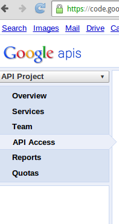

# NodeJS Youtube API Test
Test application that tests Youtube API NodeJS module.

## Before you start

1. You need a [Google Account](https://www.google.com/accounts/NewAccount) to access the Google APIs Console, request an API key, and register your application.

1. [Register your application](https://developers.google.com/youtube/registering_an_application)  with Google so that it can submit API requests.

1. After registering your application, select the YouTube Data API as one of the services that your application uses:

  - Go to the [APIs Console](https://code.google.com/apis/console/) and select the project that you just registered.
  - Click on the Services pane.
  - In the list of APIs, find the **YouTube Data API and change** its status to ON.

1. Familiarize yourself with the core concepts of the JSON (JavaScript Object Notation) data format. JSON is a common, language-independent data format that
provides a simple text representation of arbitrary data structures. For more information, see [json.org](http://json.org/).

[[from documentation]](https://developers.google.com/youtube/v3/getting-started)

## Installation

1. Download this repository using:

```
git clone http://github.com/IonicaBizau/test-youtube-api
```

or via `npm`:

```
npm install test-youtube-api
```

1. If you downloaded the repository using `git clone` enter in the downloaded directory and run `npm install`:

```
cd test-youtube-api
npm install
```

1. Go to your [Google apps](https://code.google.com/apis/console/b/0/) and select your application.

1. Select **`API Access`** option, like in the screen shot:



1. Then create an **OAuth 2.0 client ID**.


1. Complete the required fields:

 - Product name: what ever you want (e.g. "Youtube API Test")
 - Product logo is optional
 - Home page is optional

1. Click **Next** button.
1. Select **Web application** option.
1. Set the **site or hostname** as `localhost:3000`, so the redirect uri will be: `http://www.example.com/oauth2callback`
1. Click **Create client ID** button.
1. Rename `credentials.templ.json` into `credentials.json`.
1. Open `credentials.json` and replace `yourClientId` with the **client id** and `yourSecretKey` with **client secret** generated in the step 10.
1. Now you are ready. Start the script and open `http://localhost:3000`.

```
node index.js
```
